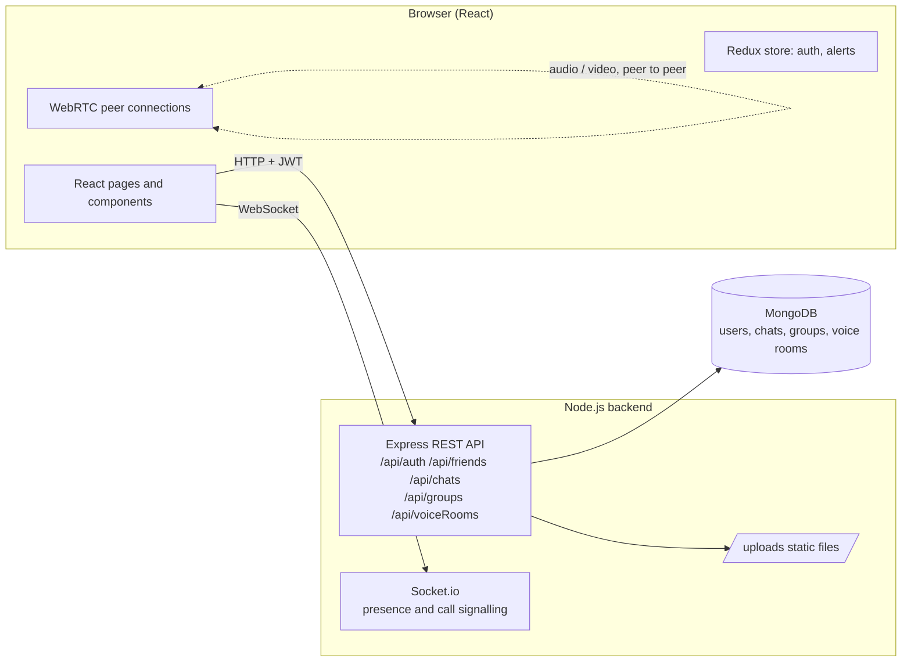

# EMSIChat

EMSIChat is a chat application I built with classmates as a group project at EMSI (Ecole Marocaine des Sciences de l'Ingenieur). Users register and log in with an email and password, send friend requests by email, and exchange text and file messages with their friends in a one-to-one conversation. Users can also create groups ("servers"), share an invite code so others can join, post messages in a group chat, and create voice rooms inside a group. Real-time features go through Socket.io: online presence of friends, signalling for one-to-one voice and video calls, and signalling for the multi-user voice rooms. The audio and video streams themselves are exchanged peer-to-peer with WebRTC.

## Stack

- Backend: Node.js, Express 5, Mongoose (MongoDB), Socket.io, JSON Web Tokens, bcrypt, Joi (request validation), multer (file uploads)
- Frontend: React 19 (Create React App), React Router, Redux with redux-thunk, Material UI, axios, socket.io-client, WebRTC APIs of the browser
- Database: MongoDB (local instance or MongoDB Atlas)

## Architecture



The REST API stores and returns data (users, friend lists, messages, groups, voice rooms). Socket.io is used for events that must reach other users immediately: the list of online users, the offer/answer/ICE messages needed to set up a WebRTC call between two friends, and the participant list of a voice room. Chat messages are written through the REST API and the client polls the API every second to refresh the conversation.

## Setup

Requirements: Node.js 18 or newer, npm, and a MongoDB instance (a local `mongod` or a MongoDB Atlas cluster).

### Backend

```bash
cd backend
npm install
cp .env.example .env   # then edit the values
npm start              # runs "nodemon server.js"
```

Environment variables (see `backend/.env.example`):

| Variable | Purpose | Example |
| --- | --- | --- |
| `API_Port` | Port for the API and Socket.io server | `5000` |
| `MONGO_URL` | MongoDB connection string | `mongodb://localhost:27017/emsichat` |
| `JWT_SECRET` | Secret used to sign login tokens | any long random string |
| `SSL_KEY_PATH` | Optional path to a TLS private key, relative to `backend/` | `ssl/localhost.key` |
| `SSL_CERT_PATH` | Optional path to a TLS certificate, relative to `backend/` | `ssl/localhost.crt` |

The server starts over plain HTTP by default. If both `SSL_KEY_PATH` and `SSL_CERT_PATH` point to existing files it starts over HTTPS instead. Browsers only allow microphone and camera access on `localhost` or on HTTPS origins, so HTTPS is needed when testing calls from another machine on the network. A self-signed certificate for local use can be generated with:

```bash
mkdir -p backend/ssl
openssl req -x509 -newkey rsa:2048 -nodes -keyout backend/ssl/localhost.key -out backend/ssl/localhost.crt -days 365 -subj "/CN=localhost"
```

Key and certificate files are ignored by git.

### Frontend

```bash
cd frontend
npm install
cp .env.example .env   # set REACT_APP_API_URL to the backend address
npm start              # development server on http://localhost:3000
npm run build          # production build in frontend/build
```

`REACT_APP_API_URL` must point to the backend, for example `http://localhost:5000` or `https://192.168.1.10:5000` when the backend uses HTTPS. It is read at build time, so restart `npm start` after changing it.

## Project structure

```
backend/
  server.js            Express app, HTTP/HTTPS selection, Mongo connection
  socket/socket.js     Socket.io events: presence, call and voice-room signalling
  routes/              authRoute, friends, chat, groups, voiceRooms
  Controllers/         login and register controllers
  middleware/auth.js   JWT verification middleware
  models/              Mongoose schemas: user, chat, group, voiceRoom
  .env.example         Environment variable template
frontend/
  src/App.js           Routes: /login, /register, /Dashboard
  src/api.js           axios client with the JWT header
  src/utils/           BASE_URL, socket client, auth helpers, validation
  src/store/           Redux reducers and actions (auth, alerts)
  src/components/      Shared UI pieces (inputs, buttons, chat input, avatar)
  src/pages/authPages/ Login and register pages
  src/pages/dashboard/ Sidebar, friends list, one-to-one messenger with calls,
                       group dashboard with group chat, members and voice rooms
  src/zickoFineWork/   Login page stylesheet and image assets contributed by a teammate
  .env.example         Environment variable template
```

## Limitations

- Only the `/api/auth/test` route is protected by the JWT middleware. The friends, chats, groups and voice-room routes trust the ids and emails sent by the client, so any caller can read or write data for any user. This would need to be fixed before exposing the backend publicly.
- Messages are not pushed over Socket.io. The messenger and group chat poll the REST API every second, which is simple but wasteful.
- The group chat listens for a `group-message` socket event and posts files to `/api/groups/:id/message/file`; neither is implemented on the backend, so file sharing in groups does not work.
- Voice rooms use a full-mesh WebRTC topology with a public STUN server only. There is no TURN server, so calls may fail across restrictive NATs.
- Uploaded files are stored on the local disk under `backend/uploads/` and are served without authentication.
- There are no automated tests.
- CORS is open to any origin.
